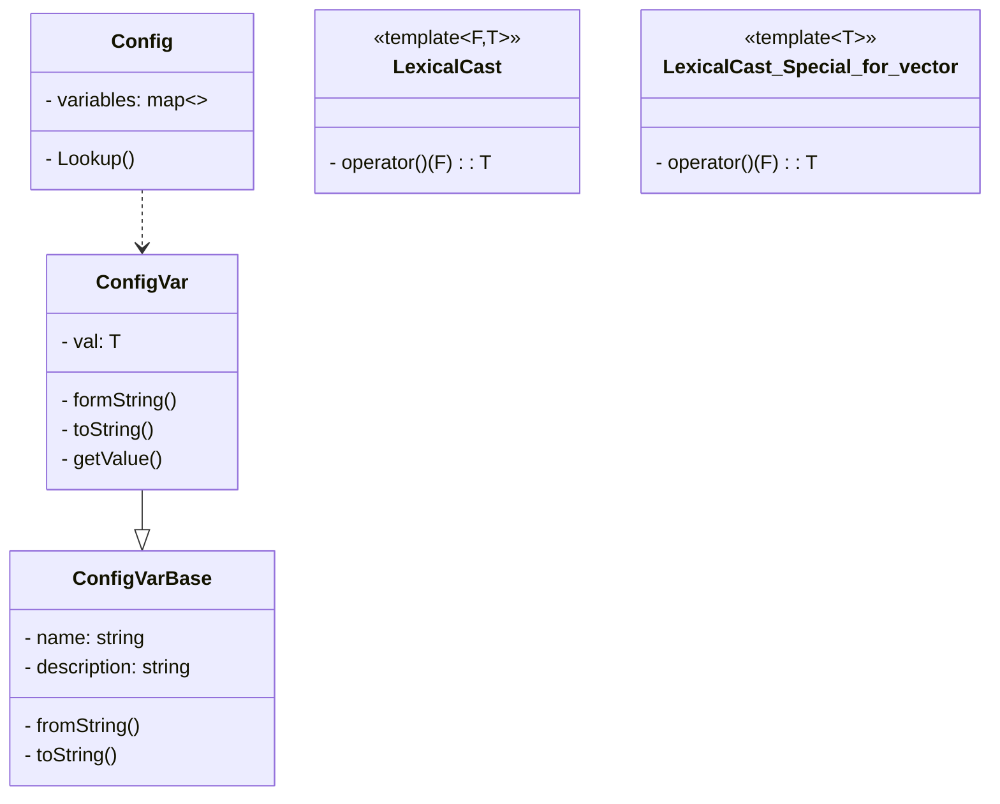

# ApexStorm

statement

## Development Environment

Fedora38 desktop
gcc 13.1
xmake 2.4

## Project Environment

```txt
.
├── bin         (output directory)
├── build       (build directory)
├── lib         ()
├── src         ()
├── tests       ()
├── README.md
└── xmake.lua   (xmake script)

```

## Logging System

1. log4J

```txt
    Logger (Log Type)
      |
      |------ Formatter (Log Format)
      |
    Appender (Log Output)

```

## Setting System

Config --> Yaml

yaml-cpp: [github](https://github.com/jbeder/yaml-cpp)

```bash
xrepo install yaml-cpp
```

```cpp
YAML::Node node = YAML::LoadFile(filename);
node.IsMap()
for(auto it = node.begin(); it != node.end(); ++it) {
  it->first, it->second
}

node.IsSequence()
for(size_t i = 0; i < node.size(); ++i) {

}

node.IsScalar();
```

Configuration system principle, convention is better than configuration:

```cpp
template<T, FromStr, ToStr>
class ConfigVar;

template<F, T>
LexicalCast;
```

Container deviation specialization:

- vector
- list
- set
- unordered_set
- map (key = std::string)
- unordered_map (key = std::string)

tips:

- self defined `class` should implement
  `apexstorm::LexicalCast` derivation specialization,
  then `Config` will support parsing.

- self defined `class` can be used with regular `stl`(mention above) nesting.

Details examples are in `tests/test_config.cpp`.

Setting Event mechanism:
when a setting has changed, it will notify to the corresponding code, and callback.

## Logger Settings System

```yaml
logs:
  - name: root
    level: (debug, info, warn, error, fatal)
    formatter: "%d%T%p%T%t"
    appender:
      - type: (StdoutLogAppender, FileLogAppender)
        level: (debug, ...)
        file: /logs/xxx.log
```

```cpp
  apexstorm::Logger g_logger =
      apexstorm::LoggerMgr::GetInstance()->getLogger(name);
  APEXSTORM_LOG_INFO(g_logger) << "xxx log";
```

```cpp
static Logger::ptr g_log = APEXSTORM_LOG_NAME("system);
// m_root, m_system -> m_root , when logger appenders is empty, use root to write log.
```

```cpp
// define: LogDefine LogAppenderDefine, derivation specification(LexicalCast<std::string, LogDefine>)
// implementation log settings parsing
```




## Thread Related Encapsulation

Thread, Mutex encapsulation:

- Mutex
- SpinLock
- CASLock
- RWMutex
- Semaphore

integrate with log

logger, logAppender

using SpinLock instead of Mutex

write file periodic reopen(should fixed).

## Coroutine Library Encapsulation

## Socket Library

## Http Protocol Development

## Distributed Protocol

## Recommender System
