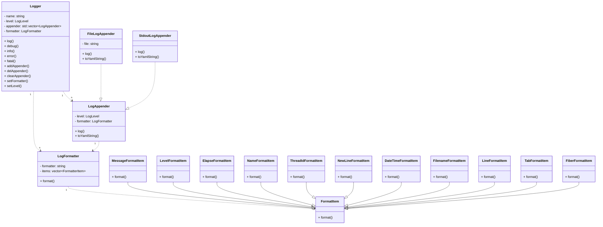
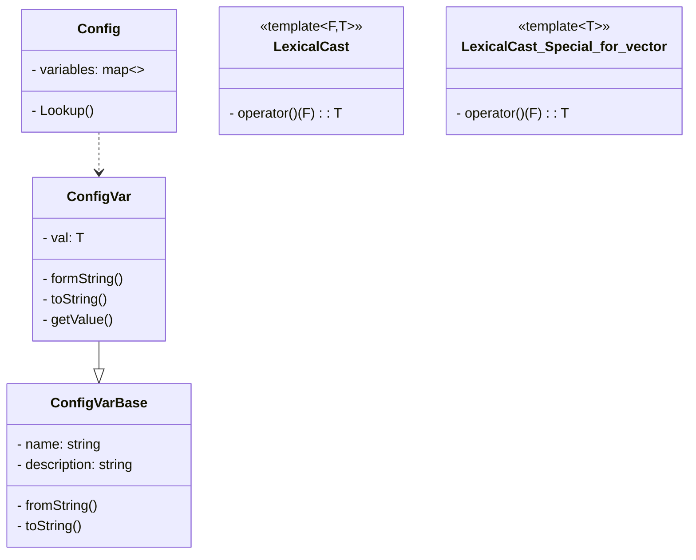
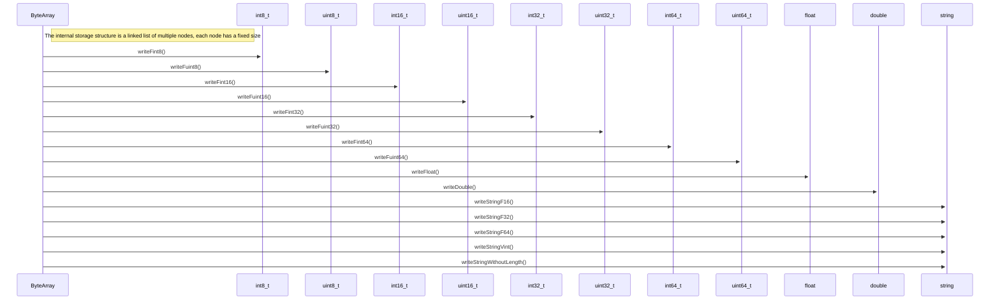
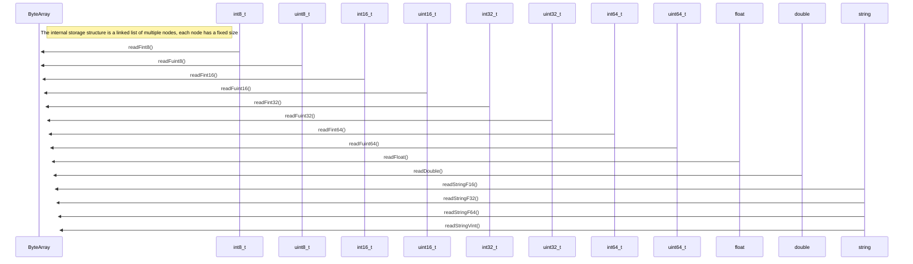

# ApexStorm

statement

## Development Environment

Fedora38 desktop
gcc 13.1
xmake 2.4
in fedora: sudo dnf install boost-devel

## Project Environment

```txt
.
├── bin         (output directory)
├── build       (build directory)
├── lib         ()
├── src         ()
├── tests       ()
├── README.md
└── xmake.lua   (xmake script)

```

## Logging System

1. log4J

```txt
    Logger (Log Type)
      |
      |------ Formatter (Log Format)
      |
    Appender (Log Output)

```

## Setting System

Config --> Yaml

yaml-cpp: [github](https://github.com/jbeder/yaml-cpp)

```bash
xrepo install yaml-cpp
```

```cpp
YAML::Node node = YAML::LoadFile(filename);
node.IsMap()
for(auto it = node.begin(); it != node.end(); ++it) {
  it->first, it->second
}

node.IsSequence()
for(size_t i = 0; i < node.size(); ++i) {

}

node.IsScalar();
```

Configuration system principle, convention is better than configuration:

```cpp
template<T, FromStr, ToStr>
class ConfigVar;

template<F, T>
LexicalCast;
```

Container deviation specialization:

- vector
- list
- set
- unordered_set
- map (key = std::string)
- unordered_map (key = std::string)

tips:

- self defined `class` should implement
  `apexstorm::LexicalCast` derivation specialization,
  then `Config` will support parsing.

- self defined `class` can be used with regular `stl`(mention above) nesting.

Details examples are in `tests/test_config.cpp`.

Setting Event mechanism:
when a setting has changed, it will notify to the corresponding code, and callback.

## Logger Settings System

```yaml
logs:
  - name: root
    level: (debug, info, warn, error, fatal)
    formatter: "%d%T%p%T%t"
    appender:
      - type: (StdoutLogAppender, FileLogAppender)
        level: (debug, ...)
        file: /logs/xxx.log
```

```cpp
  apexstorm::Logger g_logger =
      apexstorm::LoggerMgr::GetInstance()->getLogger(name);
  APEXSTORM_LOG_INFO(g_logger) << "xxx log";
```

```cpp
static Logger::ptr g_log = APEXSTORM_LOG_NAME("system);
// m_root, m_system -> m_root , when logger appenders is empty, use root to write log.
```

```cpp
// define: LogDefine LogAppenderDefine, derivation specification(LexicalCast<std::string, LogDefine>)
// implementation log settings parsing
```





## Thread Related Encapsulation

Thread, Mutex encapsulation:

- Mutex
- SpinLock
- CASLock
- RWMutex
- Semaphore

integrate with log

logger, logAppender

using SpinLock instead of Mutex

write file periodic reopen(should fixed).

## Coroutine Library Encapsulation

more relevant introduction: [coroutine_cpp_zh](./notes/coroutine_cpp_zh.md)

Coroutine interface

ucontext_t

```cpp
// get current context and storing in `ucp` structure.
int getcontext(ucontext_t *ucp);

// set current context to `ucp`. `ucp` should get by `getcontext` or `makecontext`.
int setcontext(const ucontext_t *ucp);

// modify `ucp` (get by `getcontext`), setting `ucp` context (func).
void makecontext(ucontext_t *ucp, void (*func)(), int argc...);

// swap current context into `ucp` and storing previous context into `old_ucp`.
int swapcontext(ucontext_t *old_ucp, const ucontext_t * ucp);
```

macro for debugging

```cpp
Fiber::GetThis()
Thread -> main_fiber <----> sub_fiber
              ^
              |
              |
              |
           sub_fiber
```

coroutine scheduler

```cpp
          1 - N         1 - M
scheduler -- --> thread -- --> fiber
1. thread pool, allocate a group of threads.
2. coroutine scheduler, assign the coroutine to the corresponding thread for execution.

N : M

m_threads
<function<void() | Fiber, thread_id>>m_fibers

schedule(func/fiber)

start()
stop()
run()

1. set current thread scheduler
2. set current thread run, fiber
3. coroutine schedule while(true)
  1. coroutine message queue whether has task?
  2. not task, execute idle.
```

```cpp
IOManager (epoll) ---> Scheduler
    |
    |
    |
  idle (epoll_wait)


  semaphore
PutMessage(msg,) semaphore + 1 single()
message_queue
    |
    |------- Thread
    |------- Thread
      - wait() semaphore 1, RecvMessage(msg,)

asynchronous io,
waiting data back, block_on epoll_wait

epoll_create , epoll_ctl, epoll_wait

more relevant introduction: [epoll_io_cp_zh](./notes/epoll_io_cpp_zh.md.md)

```

```cpp
Timer --> addTimer() --> cancel()
acquire internal time between current timer and its trigger time
acquire timer needed trigger
```

```cpp
     [Fiber]             [Timer]
        |N                  |
        |1                  |
    [Thread]          [TimerManager]
        |M                  |
        |1                  |
   [Scheduler] <---- [IOManager(epoll)]
```

## HOOK

here are origin API：

-- sleep hook --

```c
unsigned int sleep(unsigned int seconds);
int usleep(useconds_t usec);
int nanosleep(const struct timespec *req, struct timespec *rem);
```

-- socket hook --

```c
int socket(int domain, int type, int protocol);
int connect(int sockfd, const struct sockaddr *addr, socklen_t addrlen);
int accept(int sockfd, struct sockaddr *addr, socklen_t *addrlen);
```

-- socket read hook --

```c
ssize_t read(int fd, void *buf, size_t count);
ssize_t readv(int fd, const struct iovec *iov, int iovcnt);
ssize_t recv(int sockfd, void *buf, size_t len, int flags);
ssize_t recvfrom(int sockfd, void *buf, size_t len, int flags,
                 struct sockaddr *src_addr, socklen_t *addrlen);
ssize_t recvmsg(int sockfd, struct msghdr *msg, int flags);
```

-- socket write hook --

```c
ssize_t write(int fd, const void *buf, size_t count);
ssize_t writev(int fd, const struct iovec *iov, int iovcnt);
ssize_t send(int sockfd, const void *buf, size_t len, int flags);
ssize_t sendto(int sockfd, const void *buf, size_t len, int flags,
               const struct sockaddr *dest_addr, socklen_t addrlen);
ssize_t sendmsg(int sockfd, const struct msghdr *msg, int flags);
```

-- socket close --

```c
int close(int fd);
```

-- fcntl --

```c
int fcntl(int fd, int cmd, ... /* arg */);
```

-- ioctl --

```c
int ioctl(int fd, unsigned long request, ...);
```

-- socket get/set options --

```c
int getsockopt(int sockfd, int level, int optname, void *optval,
               socklen_t *optlen);
int setsockopt(int sockfd, int level, int optname, const void *optval,
               socklen_t optlen);
```

more relevant introduction: [hook_zh](./notes/hook_zh.md)

## Socket Library

```cpp
Address -- [IPAddress] -- [IPv4Address] / [IPv6Address]
  |  \
  |    \ [UnixAddress] (same machine)
  |
Socket
```

Address: the base of all address type, corresponding `sockaddr` type,
providing host lookup and network interface lookup.

IPAddress: basing on `Address`, providing abilities for relevant port number,
and network mask, broadcast address, network segment address.

IPv4Address -> `sockaddr_in`

IPv6Address -> `sockaddr_in6`

UnixAddress -> `sockaddr_un`

socket address:

```c
struct sockaddr
{
    unsigned short sa_family; // protocol cluster
    char sa_data[14];         // address metadata
};
struct sockaddr_in
{
    unsigned short sin_family; // AF_INET
    unsigned short sin_port;   // port number
    struct in_addr sin_addr;   // IPv4 use a uint32_t number
    char sin_zero[8];          // fill with 0
};

struct sockaddr_in6
{
    unsigned short sin6_family; // AF_INET6
    in_port_t sin6_port;        // port number
    uint32_t sin6_flowinfo;     // IPv6 flow control information
    struct in6_addr sin6_addr;  // IPv6 address, which is a 128 bit structure
    uint32_t sin6_scope_id;     // IPv6 scope-id
};

struct sockaddr_un
{
    unsigned short sun_family;  // AF_UNIX
    char sun_path[108];         // path string
};
```

Socket(self_shared_ptr, Noncopyable):

metadata:

- file descriptor(socket fd)
- address type(AF_INET, AF_INET6, AF_UNIX)
- socket type(SOCKET_STREAM, SOCKET_DRAM)
- protocol type(NO_DELAY)
- whether is connected
- local address and remote address

provided method:

- create tcp socket, udp socket, unix socket
- set socket option, get socket option (based on hooked)
- bind/connect/listen (based on hooked)
- accept, close (based on hooked)
- send data / receive data (based on hooked)
- get local address / get remote address
- get socket type, address type, protocol type
- cancel socket read/write event

## Serializer and Deserializer(ByteArray)

write(int, float, int64,...)
read (int, float, int64,...)

ZipZag protocol:
Put the sign bit in the lowest bit.

Serializer:



Deserializer:



compression:

```cpp
void ByteArray::writeUint32(uint32_t value) {
  uint8_t tmp[5]; /* 4 byte 32 bit */
  // compression
  uint8_t i = 0;
  while (value >= 0x80) {
    tmp[i++] = (value & 0x7F) | 0x80;
    value >>= 7;
  }
  tmp[i++] = value;
  write(tmp, i);
}
```

decompression:

```cpp
uint32_t ByteArray::readUint32() {
  uint32_t result = 0;
  // decompression
  for (uint8_t i = 0; i < 32; i += 7) {
    uint8_t b = readFuint8();
    if (b < 0x80) {
      result |= ((uint32_t)b) << i;
      break;
    } else {
      result |= (((uint32_t)(b & 0x7f)) << i);
    }
  }
  return result;
}
```

The above code shows the compression and decompression method in the ByteArray class, and here is a brief explanation of its implementation:

- `0x80`:
  - In the process of compression, it is used to mark whether there are numbers in the high bits.
    When the upper 7 bits of the number to be compressed are not all 0, this bit is set to 1,
    indicating that there are still numbers to be compressed; otherwise, it is set to 0.
  - During decompression, this bit is used to determine whether the end of the byte stream has been reached.
- `0x7f`:
  - In the process of compression, it is used to store valid data.
    Each byte can only represent 7 binary digits temporarily, 0x7F limits the number to 7 bits.
  - In the process of decompression, it is used to extract the valid data in each byte
- writeUint32 () method:
  This method is used to compress a `32-bit unsigned integer` into a `variable-length stream of bytes` and write it to the ByteArray.
  - This method first defines a uint8_t array of size `5`(tmp[5]), which is filled in the while loop.
  - For the `value` value,
    - take the value from the following 7 bits each time,
    - mark the highest bit as 1 to indicate that there is still data behind,
    - mark the remaining 7 bits as the value,
    - write it into the tmp array until the value is less than 0x80.
  - At this time, only the value is written to the `tmp array`. Finally, the `tmp array` is written to the ByteArray.
- readUint32 () method:
  This method is used to decompress a `variable-length byte stream` into a `32-bit unsigned integer` and return its value.
  - In the loop,
    - one byte b is read from the ByteArray each time
      - written to the result until b is less than 0x80(indicating that there is no more data)
      - and the result is shifted to the left by `i` bits and returned.

This method shows the process of variable-length compression and decompression of the byte stream.

Benefiting from the design of variable length, the compressed length of each number may be different.

When the number is less than 0x80 (128), it is the last part of the data. At this time, there is no need to mark symbols.

Mark the upper part of it as 1, indicating that there is data behind it,
and the lower seven bits store the actual value of the number.

The decompression process is also very simple.
According to the compression process, from the upper part to the lower part,
the previous result is shifted to the left by 7 bits each time,
and the new lower 7 bits are OR with it, and finally the original number is obtained.

## Http Protocol Development

HTTP/1.1 - API

HttpRequest:
HttpResponse:

```http
GET / HTTP/1.1
Host: www.baidu.com
```

```http
HTTP/1.1 200 OK
Accept-Ranges: bytes
Cache-Control: no-cache
Connection: keep-alive
Content-Length: 9508
```

uri: http://xxx.com:80/page/yyy?id=1&v=20#fr
|uri|type|
|---|---|
|http| protocol|
|xxx.com| host|
|80| port number|
|/page/yyy| path|
|id=1&v| query|
|fr| fragment|

ragel [mongrel2](https://github.com/mongrel2/mongrel2/tree/master) (lib/include/http/http11)

- http11_common.h
- http11_parser.h
- http11_parser.rl
- httpclient_parser.h
- httpclient_parser.rl
- http11_parser.rl.cpp
- httpclient_parser.rl.cpp

```cmd
ragel -G2  http11_parser.rl -o http11_parser.rl.cpp
ragel -G2 httpclient_parser.rl -o httpclient_parser.rl.cpp
```

TcpServer:

should override the virtual method `handleClient`

implement example [echoServer](examples/echo_server.cpp)

## Distributed Protocol

## Recommender System
