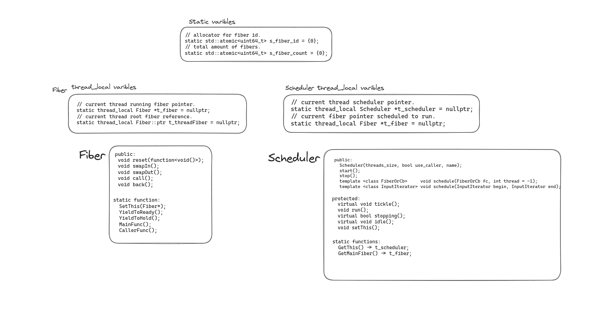
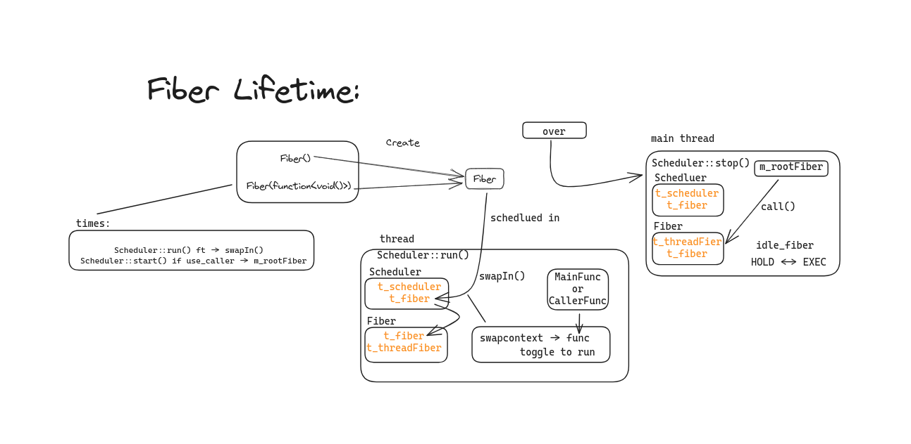
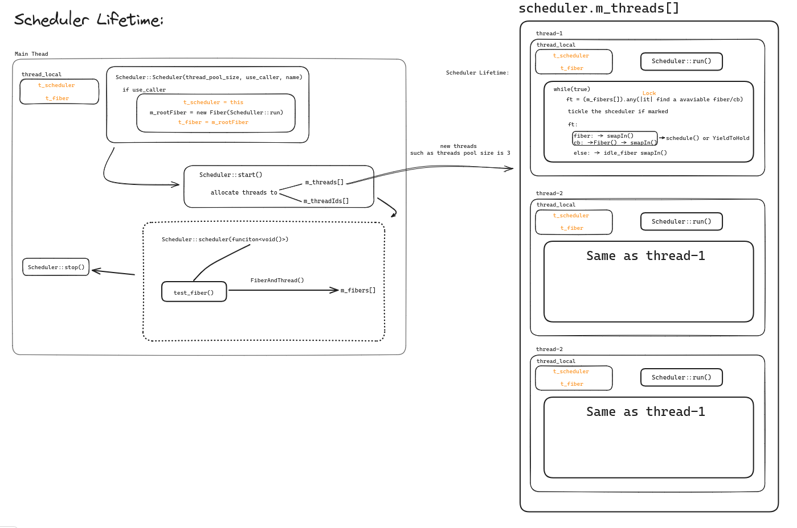

# 协程/异步

<!-- @import "[TOC]" {cmd="toc" depthFrom=1 depthTo=6 orderedList=false} -->

<!-- code_chunk_output -->

- [协程/异步](#协程异步)
  - [Brief Instruction](#brief-instruction)
  - [Fiber](#fiber)
    - [Fiber Constructor and Destructor](#fiber-constructor-and-destructor)
      - [Fiber()](#fiber-1)
      - [Fiber(function\<void()\>,stack\_size, use\_caller)](#fiberfunctionvoidstack_size-use_caller)
      - [~Fiber()](#fiber-2)
    - [Fiber Public Functions](#fiber-public-functions)
      - [void Fiber::reset(function\<void()\>)](#void-fiberresetfunctionvoid)
      - [void Fiber::call()](#void-fibercall)
      - [void Fiber::back()](#void-fiberback)
      - [void Fiber::swapIn()](#void-fiberswapin)
      - [void Fiber::swapOut()](#void-fiberswapout)
    - [Fiber Static Functions](#fiber-static-functions)
      - [Fiber::ptr Fiber::GetThis()](#fiberptr-fibergetthis)
      - [void Fiber::YieldToReady/Hold()](#void-fiberyieldtoreadyhold)
      - [Fiber::MainFunc()](#fibermainfunc)
      - [Fiber::CallerMainFunc()](#fibercallermainfunc)
  - [Scheduler](#scheduler)
    - [Scheduler Constructor and Destructor](#scheduler-constructor-and-destructor)
      - [Scheduler(threads\_size, bool use\_caller, name)](#schedulerthreads_size-bool-use_caller-name)
      - [~Scheduler()](#scheduler-1)
    - [Scheduler Public Functions](#scheduler-public-functions)
      - [Scheduler::start()](#schedulerstart)
      - [Scheduler::stop()](#schedulerstop)
      - [void Scheduler::schedule(FiberOrCb fc, int thread = -1)](#void-schedulerschedulefiberorcb-fc-int-thread---1)
    - [Protected Functions](#protected-functions)
      - [Scheduler::run()](#schedulerrun)
      - [Scheduler::idle()](#scheduleridle)

<!-- /code_chunk_output -->

## Brief Instruction

---

`协程`和`异步`的区别 (from gpt)：

- 异步编程是一种并发编程的模式，它通过在处理 I/O 操作和时间处理等任务的同时执行代码，从而实现在单个线程中同时处理多项任务的能力。异步编程通常使用回调函数或订阅者模式，即当 I/O 操作或事件处理完成时，将调用相关的回调函数以通知程序执行下一步操作。异步编程通常适用于 I/O 密集型任务，例如网络通信和数据库访问等操作。

- 协程是一种轻量级线程，可在单个线程中执行。与传统线程不同，协程支持暂停和恢复执行，从而可以在相同的堆栈中执行多个子例程，而不必切换堆栈或线程。协程通常使用 "async/await"机制或调度器来实现多个协程的调度和执行。协程通常适用于计算密集型任务或需要更灵活的协作多任务编程，例如游戏物理模拟和图形处理等操作。

---

在 rust 中， 官方 std 库只提供了最基础的抽象,提供了对 异步代码块 包装成`Futures`, 以及用于唤醒`Futures`的`Waker`，而不包括用于调度异步任务的相关功能， 这些调度需要第三方库的支持例如：`tokio`.

`Futures` 即把异步代码通过编译器来包装成状态机, 每次访问该状态机， 如果等待的事件到来了就返回 OK(value)， 否则就在专门用于`检测事件到来和唤醒相关`Futures`的模块`(类似 linux 的 epoll, window 的 iocp 的封装)中注册回调函数, 并休眠起来. 然后当等待事件到来后就会唤醒该对应`Futures` 并令其能够被调度.

而作为调度器的`tokio`，其作用就是初始化一个线程池， 合理分配异步任务(防止任务饥饿， 检测等待事件的到来), 其中运用到很多并发的技术.

相关资料：<https://github.com/kyrosle/async_try>

---

而在 cpp 中 在语言层面支持协程是在 cpp20 [Coroutine](https://en.cppreference.com/w/cpp/language/coroutines), 在此之前都得自己去封装和实现.

目前看到大概有四种实现协程的方式(csdn)：

- 第一种：利用 glibc 的 ucontext 组件(云风的库)
- 第二种：使用汇编代码来切换上下文(实现 c 协程)
- 第三种：利用 C 语言语法 switch-case 的奇淫技巧来实现（Protothreads)
- 第四种：利用了 C 语言的 setjmp 和 longjmp（ 一种协程的 C/C++ 实现,要求函数里面使用 static local 的变量来保存协程内部的数据）

在 cpp11 中 在用于 linux 的协程封装用到以下的系统层面 api [Introduction](https://blog.csdn.net/qq910894904/article/details/41911175/?ops_request_misc=&request_id=&biz_id=102&utm_term=makecontext%20cpp&utm_medium=distribute.pc_search_result.none-task-blog-2~all~sobaiduweb~default-1-41911175.142^v88^control_2,239^v2^insert_chatgpt&spm=1018.2226.3001.4187):

```cpp
struct ucontext {
  struct ucontext *uc_link;
  sigset_t         uc_sigmask;
  stack_t          uc_stack;
  mcontext_t       uc_mcontext;
  ...
} ucontext_t;

// 保存当前上下文 到 ucp
int getcontext(ucontext_t *ucp);

// 设置当前的上下文 ucp， ucp 来自 getcontext 或者 makecontext
int setcontext(const ucontext_t *ucp);

// 但上下文发生切换(setcontext / swapcontext), 触发func, argc 是 func 参数的个数
void makecontext(ucontext_t *ucp, void (*func)(), int argc...);

// 切换到 ucp 上下文， 旧的上下文保存在 old_ucp
int swapcontext(ucontext_t *old_ucp, const ucontext_t * ucp);
```

---



## Fiber

异步模型:


```cpp
class Fiber {
public:
  // 保存当前的上下文到 m_ctx,
  Fiber(function<void()>, stack_size: usize, use_caller: bool);
  void reset(function<void()>);
  void swapIn();
  void swapOut();
  void call();
  void back();

static function:
  SetThis(Fiber*);
  YieldToReady();
  YieldToHold();
  MainFunc();
  CallerFunc();

enum class FiberState {
  // 初始状态
  INIT,
  // 暂停状态
  HOLD,
  // 执行中状态
  EXEC,
  // 结束状态
  TERM,
  // 可执行状态
  READY,
  // 异常状态
  EXCEPT
};

// 分配 fiber id
static atomic<uint64_t> s_fiber_id = {0};
// fiber 总数量
static atomic<uint64_t> s_fiber_count = {0};

// 当前 线程 运行的 fiber 指针
static thread_local Fiber *t_fiber = nullptr;
// 当前 线程 作为 交换缓存 fiber 的引用对象
static thread_local Fiber::ptr t_threadFiber = nullptr;
```

### Fiber Constructor and Destructor

#### Fiber()

无参数构造

```cpp
  // 设置 fiber 状态
  m_state = State::EXEC;
  // 设置 当前线程中 运行的 fiber 为 当前这个 fiber 对象
  SetThis(this);

  // 获取当前上下文， 保存在 m_ctx, 成功返回 0
  if (getcontext(&m_ctx))

  // 总 fiber 计数
  ++s_fiber_count;
```

#### Fiber(function<void()>,stack_size, use_caller)

回调函数存在 `m_cb`, 传入 fiber 栈大小 默认为 0, 是否使用调用的线程.

```cpp
  // 总 fiber 计数
  ++s_fiber_count;

  // 设置 fiber stack_size, 传入值 或 使用默认配置
  m_stacksize = stacksize ? stacksize : g_fiber_stack_size->getValue();
  m_stack = StackALloc::Alloc(m_stacksize);

  // 获取当前上下文， 保存在 m_ctx, 成功返回 0
  if (getcontext(&m_ctx))

  // 当前上下文运行种子是退出
  m_ctx.uc_link = nullptr;

  m_ctx.uc_stack.ss_sp = m_stack;
  m_ctx.uc_stack.ss_size = m_stacksize;

  // 根据时候使用调用的线程, 来添加对应的触发运行函数
  if (!use_caller) {
    makecontext(&m_ctx, &Fiber::MainFunc, 0);
  } else {
    makecontext(&m_ctx, &Fiber::CallerMainFunc, 0);
  }
```

#### ~Fiber()

```cpp
  // 总 fiber 计数
  --s_fiber_count;

  // 释放 fiber 栈空间
  if (m_stack) {
    StackALloc::Dealloc(m_stack, m_stacksize);
  } else {
    // 如果当前线程在跑这个 fiber, 置空
    Fiber *cur = t_fiber;
    if (cur == this) {
      SetThis(nullptr);
    }
  }
```

### Fiber Public Functions

#### void Fiber::reset(function<void()>)

```cpp
  // 替换 fiber 的回调
  m_cb = cb;

  // 获取当前上下文， 保存在 m_ctx, 成功返回 0
  if (getcontext(&m_ctx))

  // same as above
  m_ctx.uc_link = nullptr;
  m_ctx.uc_stack.ss_sp = m_stack;
  m_ctx.uc_stack.ss_size = m_stacksize;

  // 后续调用 setcontext / swapcontext 都会触发 Fiber::MainFunc
  makecontext(&m_ctx, &Fiber::MainFunc, 0);

  // fiber state -> INIT
  m_state = State::INIT;
```

#### void Fiber::call()

```cpp
  // 设置 当前线程中 运行的 fiber 为 当前这个 fiber 对象
  SetThis(this);
  // fiber state -> EXEC
  m_state = State::EXEC;

  // 上下文切入 当前 fiber 的 m_ctx, 当前的上下文保存在线程缓存变量t_threadFiber中,
  // 后续 Fiber::back() 切换回来.
  if (swapcontext(&t_threadFiber->m_ctx, &m_ctx))
```

#### void Fiber::back()

```cpp
  // 设置 当前线程中 运行的 fiber 为 上次 Fiber::call() 暂存的 fiber
  SetThis(t_threadFiber.get());
  // 上下文 对应 Fiber::call() 切换回来
  if (swapcontext(&m_ctx, &t_threadFiber->m_ctx))
```

#### void Fiber::swapIn()

```cpp
  // 设置 当前线程中 运行的 fiber 为 当前这个 fiber 对象
  SetThis(this);

  // fiber status -> EXEC
  m_state = State::EXEC;

  // 上下文切入 到 当前 fiber，
  // 当前上下文 暂存到 Scheduler 中的 当前线程 的 运行fiber
  if (swapcontext(&Scheduler::GetMainFiber()->m_ctx, &m_ctx))
```

#### void Fiber::swapOut()

```cpp
  // 切换回 Scheduler 该正在运行的 fiber
  SetThis(Scheduler::GetMainFiber());

  // 上下文 对应 Fiber::swapIn() 切换回来
  if (swapcontext(&m_ctx, &Scheduler::GetMainFiber()->m_ctx))
```

### Fiber Static Functions

#### Fiber::ptr Fiber::GetThis()

返回当前运行中的 fiber

```cpp
  if (t_fiber) {
    return t_fiber->shared_from_this();
  }

  // 初始状态， 当前线程中没有运行的 fiber,
  // new 一个并且 设置为当前线程 的主 fiber,
  // 无参构造 - main_fiber 把自己赋值给 t_fiber
  Fiber::ptr main_fiber(new Fiber);
  t_threadFiber = main_fiber;
  return t_fiber->shared_from_this();
```

#### void Fiber::YieldToReady/Hold()

把当前的 t_fiber 的 m_state -> Ready/Hold, 然后 swapOut()

#### Fiber::MainFunc()

```cpp
  // 当前 线程 正在运行的 fiber:  t_fiber
  Fiber::ptr cur = GetThis();

  try {
    // 执行 fiber 的 回调函数
    cur->m_cb();
    // 回调函数执行完毕 - fiber 任务完成
    // 清理工作
    cur->m_cb = nullptr;
    cur->m_state = State::TERM;

  }
  // -- 回调函数 执行异常处理 --
  catch (std::exception &ex) {
    cur->m_state = State::EXCEPT;
  } catch (...) {
    cur->m_state = State::EXCEPT;
  }
  // --                   --


  // 取出这个 fiber 的裸指针
  auto raw_ptr = cur.get();
  // t_fiber 计数 - 1
  cur.reset();
  // 当前这个 fiber 切出, 切到 Scheduler 线程的 t_fiber (和CallerMainFunc() 不同)
  raw_ptr->swapOut();

  // ! never reach here !
```

#### Fiber::CallerMainFunc()

```cpp
  // 当前 线程 正在运行的 fiber:  t_fiber
  Fiber::ptr cur = GetThis();

  try {
    // 执行 fiber 的 回调函数
    cur->m_cb();
    // 回调函数执行完毕 - fiber 任务完成
    // 清理工作
    cur->m_cb = nullptr;
    cur->m_state = State::TERM;

  }
  // -- 回调函数 执行异常处理 --
  catch (std::exception &ex) {
    cur->m_state = State::EXCEPT;
  } catch (...) {
    cur->m_state = State::EXCEPT;
  }
  // --                   --

  // 取出这个 fiber 的裸指针
  auto raw_ptr = cur.get();
  // t_fiber 计数 - 1
  cur.reset();
  // 当前这个 fiber 切出, 切到 当前线程的 t_threadFiber (和MainFunc() 不同)
  raw_ptr->back();

  // ! never reach here !
```

## Scheduler

协程调度模块:


```cpp
class Scheduler {
public:
  Scheduler(threads_size, bool use_caller, name);
  start();
  stop();
  template <class FiberOrCb>     void schedule(FiberOrCb fc, int thread = -1);
  template <class InputIterator> void schedule(InputIterator begin, InputIterator end);
protected:
  virtual void tickle();
  void run();
  virtual bool stopping();
  virtual void idle();
  void setThis();
static functions:
  GetThis() -> t_scheduler;
  GetMainFiber() -> t_fiber;
private:
  template <class FiberOrCb> bool scheduleNoLock(FiberOrCb fc, int thread);
};

// 当前 线程 的 调度器 对象
static thread_local Scheduler *t_scheduler = nullptr;
// 当前 线程 的 调度的 fiber 对象
static thread_local Fiber *t_fiber = nullptr;


// 保存 Fiber 或者 回调函数 的数据结构
struct FiberAndThread {
  Fiber::ptr fiber;
  std::function<void()> cb;
  int thread;

  FiberAndThread(Fiber::ptr f, int thread_id) : fiber(f), thread(thread_id) {}
  FiberAndThread(Fiber::ptr *f, int thread_id) : thread(thread_id) { fiber.swap(*f); }
  FiberAndThread(std::function<void()> c, int thread_id) : cb(c), thread(thread_id) {}
  FiberAndThread(std::function<void()> *c, int thread_id) : thread(thread_id) { b.swap(*c); }
  FiberAndThread() : thread(-1) {}

  void reset() {
    fiber = nullptr;
    cb = nullptr;
    thread = -1;
  }
};

```

### Scheduler Constructor and Destructor

#### Scheduler(threads_size, bool use_caller, name)

创建 协程 调度器, threads_size 线程池大小 默认为 1, user_caller 时候使用当前线程

```cpp
  // 使用 调用的 线程
  if (use_caller) {
    // 在此 线程上 创建 主fiber
    apexstorm::Fiber::GetThis();
    --threads;

    // 设置当前线程的 调度器对象
    t_scheduler = this;

    // 设置当前 主fiber 回调函数 为 Scheduler::run()
    m_rootFiber.reset(new Fiber(std::bind(&Scheduler::run, this), 0, true));

    // 设置 线程名称
    apexstorm::Thread::SetName(m_name);

    // 当前现场 执行 fiber 为 如上新创建的 root_fiber
    t_fiber = m_rootFiber.get();

    // 设置主线程所 的线程id(当前这个)
    m_rootThread = apexstorm::GetThreadId();
  } else {
    m_rootThread = -1;
  }

  // 线程池大小
  m_threadCount = threads;
```

#### ~Scheduler()

```cpp
  // 如果 当前线程 的调度器 是当前实例
  if (GetThis() == this) {
    t_scheduler = nullptr;
  }
```

### Scheduler Public Functions

#### Scheduler::start()

```cpp
  { // 互斥锁, 需要修改 m_threads, m_threadIds
    MutexType::Lock lock(m_mutex);
    // 构造时候默认为 true, 防止再启动
    if (!m_stopping) {
      return;
    }
    // 停止标志
    m_stopping = false;

    // 分配线程池
    m_threads.resize(m_threadCount);
    for (size_t i = 0; i < m_threadCount; ++i) {
      m_threads[i].reset(new Thread(std::bind(&Scheduler::run, this),
                                    m_name + "_" + std::to_string(i)));
      // 添加新建线程的id, 此处通过 `syscall(SYS_gettid)` 获取新建线程id,
      // 因为 当前线程 和 新建线程使用了semaphore来同步,
      // 因此调用该方法会始终在新线程创建后
      m_threadIds.push_back(m_threads[i]->getId());
    }
  }
```

#### Scheduler::stop()

graceful stop function

```cpp
  // 调度器可以滑如 stop 状态
  m_autoStop = true;
  // 进入 退出状态 同时条件:
  // 1. 有 root_fiber
  // 2. root_fiber status == TERM | INIT
  // 3. 线程池大小 == 0
  if (m_rootThread && m_threadCount == 0 &&
      ((m_rootFiber->getState() == Fiber::State::TERM) ||
       m_rootFiber->getState() == Fiber::State::INIT)) {
    m_stopping = true;

    // fiber[] empty && active_thread_count == 0
    if (stopping()) {
      return;
    }
  }

  m_stopping = true;
  // 唤醒所有线程
  for (size_t i = 0; i < m_threadCount; ++i) {
    tickle();
  }

  // 唤醒 root_fiber
  if (m_rootFiber) {
    tickle();
  }

  // fiber[] empty && active_thread_count == 0
  if (stopping()) {
    return;
  }

  if (m_rootFiber) {
    // 有 root_fiber 但 有未完成任务
    if (!stopping()) {
      // 切入 root_fiber, 当前上下文 暂存在当前线程
      m_rootFiber->call();
    }
  }

  // join 所有线程池中所有线程
  std::vector<Thread::ptr> thrs;
  {
    MutexType::Lock lock(m_mutex);
    thrs.swap(m_threads);
  }
  for (auto &i : thrs) {
    i->join();
  }
```

#### void Scheduler::schedule(FiberOrCb fc, int thread = -1)

添加进 m_fibers 队列, 上互斥锁然后执行逻辑:

```cpp
    bool need_tickle = m_fibers.empty();
    FiberAndThread ft(fc, thread);
    if (ft.fiber || ft.cb) {
      m_fibers.push_back(ft);
    }
    return need_tickle;
```

### Protected Functions

#### Scheduler::run()

先前的 Scheduler::start(), 分配完成线程池, 而且每个线程都是执行 该 run()方法
对于每个线程他们有的 线程缓存变量(thread_local):

- Scheduler 下 t_scheduler 指向自己的所属调度器
- Scheduler 下 t_fiber 当前自己正在执行的 fiber

```cpp
  // 初始化当前新建线程的 线程缓存变量

  // 创建 root_fiber 并设定为当前线程 的 t_fiber(当前执行fiber) 和 t_threadFiber(当前fiber缓存)
  Fiber::GetThis();
  // 设定自己为当前线程 t_scheduler
  setThis();

  // 如果当前线程不是 实例化Scheduler的线程 或者 m_rootThread == -1
  // 当前 Scheduler 所在线程 的执行 fiber 换成当前 fiber
  if (apexstorm::GetThreadId() != m_rootThread) {
    t_fiber = Fiber::GetThis().get();
  }

  // idle fiber, 执行 idle 逻辑
  Fiber::ptr idle_fiber(new Fiber(std::bind(&Scheduler::idle, this)));
  // 暂存
  Fiber::ptr cb_fiber;
  FiberAndThread ft;

  // 循环调度
  while (true) {
    ft.reset();

    // 唤醒 所属调度器 标记
    bool tickle_me = false;
    // 遍历寻找有效 标记
    bool is_active = false;

    // 寻找出要调度的 FiberAndThread
    { // 上互斥锁， 当前线程需要遍历 所属调度器的 m_fibers
      MutexType::Lock lock(m_mutex);
      auto it = m_fibers.begin();
      while (it != m_fibers.end()) {
        if (it->thread != -1 && it->thread != apexstorm::GetThreadId()) {
          // 该 fiber / cb 有指定的运行 线程id
          ++it;
          // 需要通知所属 调度器
          tickle_me = true;
          continue;
        }

        if (it->fiber && it->fiber->getState() == Fiber::State::EXEC) {
          // 该 fiber 已在运行中
          ++it;
          continue;
        }

        ft = *it;
        // 当前线程
        tickle_me = false;
        m_fibers.erase(it);
        // 活跃线程 预+1
        ++m_activeThreadCount;
        is_active = true;
        break;
      }
    } // -- -- -- --

    // 如果 通知所属调度器 标记触发
    if (tickle_me) {
      tickle();
    }

    // 执行调度取出的 FiberAndThread

    // -- fiber && fiber is not TERM | EXCEPT --
    if (ft.fiber && ft.fiber->getState() != Fiber::State::TERM &&
        ft.fiber->getState() != Fiber::State::EXCEPT) {

      // 切入 ft.fiber, 当前上下文 保存在 Scheduler t_fiber 中
      ft.fiber->swapIn();

      // 当前线程完成 fiber 进入 inactive 状态
      --m_activeThreadCount;

      // 若 fiber 又进入 等待执行状态,(事件到来)
      if (ft.fiber->getState() == Fiber::State::READY) {
        // 重新调度
        schedule(ft.fiber);
      } else if (ft.fiber->getState() != Fiber::State::TERM &&
                 ft.fiber->getState() != Fiber::State::EXCEPT) {
        // 暂停该 fiber
        ft.fiber->m_state = Fiber::State::HOLD;
      }

      ft.reset();
    } else if (ft.cb) {
     // -- callback function --

      // callback function -> Fiber -> swapIn()
      if (cb_fiber) {
        cb_fiber->reset(ft.cb);
      } else {
        cb_fiber.reset(new Fiber(ft.cb));
        ft.cb = nullptr;
      }
      ft.reset();

      cb_fiber->swapIn();
      // 当前线程完成 callback function 进入 inactive 状态
      --m_activeThreadCount;

      // 如上, 重新调度或者 暂停
      if (cb_fiber->getState() == Fiber::State::READY) {
        schedule(cb_fiber);
        // schedule again
        cb_fiber.reset();
      } else if (cb_fiber->getState() == Fiber::State::EXCEPT ||
                 cb_fiber->getState() == Fiber::State::TERM) {
        // this fiber should terminate
        cb_fiber->reset(nullptr);
      } else { // if (cb_fiber->getState() != Fiber::State::TERM)
               // this fiber stay holding
        cb_fiber->m_state = Fiber::State::HOLD;
        cb_fiber.reset();
      }
    } else {
    // -- -- idle -- --
      // 未能找到可调度 fiber
      if (is_active) {
        --m_activeThreadCount;
        continue;
      }

      // idle_fiber 推出
      if (idle_fiber->getState() == Fiber::State::TERM) {
        break;
      }


      // 切入 idle_fiber, 当前上下文保存在 Scheduler t_fiber
      ++m_idleThreadCount;
      idle_fiber->swapIn();
      --m_idleThreadCount;

      if (idle_fiber->getState() != Fiber::State::TERM &&
          idle_fiber->getState() != Fiber::State::EXCEPT) {
        // 置于暂停状态
        idle_fiber->m_state = Fiber::State::HOLD;
      }
    }
  }
```

#### Scheduler::idle()

当 `!stopping()` 执行 YieldToHold()

stopping() 逻辑:

```cpp
bool Scheduler::stopping() {
  MutexType::Lock lock(m_mutex);
  return m_autoStop && m_stopping && m_fibers.empty() &&
         m_activeThreadCount == 0;
}
```
